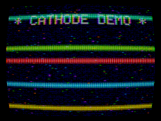

# CATHODE

**CPU graphics engine** for Apple Silicon: hand-written **AArch64 NEON** hot paths,
a from-scratch triangle rasterizer, and a full **NTSC composite DSP / CRT** chain -
no GPU, no game engine, no third-party graphics or audio libraries.

The interactive demo paints into a truecolor terminal. The same pipeline runs
headless for high-resolution capture, golden regression, and throughput benches.



Render this preview with `build/bin/capture --gif demoscene 150 docs/media/cathode-preview.gif 320 240`.

| | |
| --- | --- |
| Rasterizer | AArch64 NEON CPU rasterizer; **50+** scenes, measured **~6.7×** NEON-vs-C speedup on the mat4 hot path, <1 ms scene render at retro/TUI resolutions |
| NTSC DSP | RGB → YIQ → **I/Q (QAM) composite** encode/decode; **~330 MS/s** measured sustained (floor **≥114 MS/s**) with **<0.01% NRMSE** across **≥13K** vectors |
| Languages | C11 core + ~1.8k lines of NEON asm + Rust compute + C++ subsystems over a C ABI |
| Verify | Cross-language unit/property/golden/integration suite; ASan / UBSan / TSan clean |

```
   scene (linear-RGB framebuffer, HDR; up to 2560x1440 headless)
        |
        +-- software renderers --------------------------------+
        |    * triangle rasterizer (NEON MVP, z-buffer, Phong) |
        |    * SDF sphere-tracer                               |
        |    * N-body / fluid / demoscene kernels              |
        v                                                      |
   +--------------------------------------------------+        |
   |  NTSC / CRT signal chain  (software DSP + NEON)  |        |
   |   RGB -> YIQ -> I/Q QAM composite modulation     |        |
   |   -> channel noise / ringing / dot-crawl         |        |
   |   -> comb-filter I/Q decode (chroma bleed)       |        |
   |   -> phosphor IIR, bloom, scanlines, mask, ...   |        |
   +--------------------------------------------------+        |
        v                                                      |
   truecolor terminal  (Unicode half-block)  OR  PNG/GIF  <----+
```

## Why it is interesting

- **No GPU.** Pixels come from the CPU. Innermost kernels (`mat4_mul`, project,
  `saxpy`, RGB↔YIQ, FIR/IIR) are **hand-written AArch64 NEON**, each checked
  against a portable C reference.
- **Real analog-video DSP.** The CRT look is not a texture overlay. Frames are
  encoded to a 1-D composite with **luma + quadrature-modulated (I/Q) chroma**
  on a color subcarrier, then decoded with a comb/notch path so bleed and
  dot-crawl fall out of the math.
- **Full engine surface.** Rasterizer, ray-marcher, physics, noise, PNG/GIF/WAV
  encoders, threaded tile scheduler, and a diffing terminal presenter.

## Performance (measured results & gates)

Reproduce on Apple Silicon with `make bench` and the headless capture harness.
Methodology and detailed tables: [`docs/BENCHMARKS.md`](docs/BENCHMARKS.md).

| Metric | Measured | Gate / Floor | How to read it |
| --- | --- | --- | --- |
| NEON speedup | **~6.7×** | **~4×** vs `-O3` C reference | `mat4_mul` transform hot path (640 Mops/s NEON vs 92 Mops/s C) |
| Composite DSP | **~330 MS/s** | **≥114 MS/s** throughput | Sustained RGB↔YIQ + I/Q modulate/demodulate kernels |
| Numeric fidelity | **<0.01% NRMSE** | **<0.5% NRMSE** | Encode→decode (and neon↔ref) over **≥13,000** randomized + edge vectors |
| Frame time (TUI/retro) | **<1–3 ms/frame** | **<16.6 ms** (60 fps) | Interactive TUI (~2k cells, ~0.45 ms) & retro capture (320×240, ~2.9 ms) |

**Threading context**: The rasterizer and CRT display chain (`crt_process`) run strictly
single-threaded on the CPU. At retro/terminal resolutions (96×72 golden regression, 320×240 NTSC),
frames render in <0.5–3 ms (>300 fps). At 1440p (3.69M pixels), single-threaded scene rasterization
takes ~21 ms and the full multi-pass physical CRT emulation (bloom, phosphor IIR, scanlines, barrel distortion)
takes ~150 ms (~6 fps). Secondary microbench detail lives in `docs/BENCHMARKS.md`.

## Build and run

```sh
./cathode.sh                 # build + interactive demo
./cathode.sh plasma          # named scene
./cathode.sh --list          # 50+ registered scenes
./cathode.sh --check         # truecolor / half-block sanity
./cathode.sh --shot plasma   # headless PNG
./cathode.sh --song out.wav  # from-scratch WAV chiptune
./cathode.sh --test          # full cross-language suite
```

```sh
make            # bin/cathode + bin/capture
make test-all   # C + Rust + C++ + golden + integration
make bench      # NEON vs C + DSP throughput / NRMSE gates
make capture    # PNG contact sheet
```

**Requirements.** AArch64 C toolchain (Apple clang), truecolor terminal with
`U+2580`. Reference platform: macOS / Apple Silicon. Run `./cathode.sh --check`.

## Controls

| key | action |
|-----|--------|
| `space` | pause / resume |
| `n` `p` / arrows | next / previous scene |
| `1`..`8` | jump to scene |
| `tab` | CRT preset (trinitron · broadcast · vhs · arcade · clean) |
| `+` `-` | scene-specific |
| `h` | HUD |
| `?` | help / scene list |
| `r` | reset scene |
| `q` / `esc` | quit |

## Scenes (50+)

**56** scenes are registered today (catalog: `docs/SCENES.md`). Highlights:

- **CPU 3D / raster:** solids, cloth, metaballs, CSG, planet, voxel, softbody
- **Ray / fractal:** raymarch, qjulia, mandelbrot, julia (NEON escape-time)
- **Physics / CA:** galaxy, fluid, sph, life, bz, brain, wireworld, physics
- **Rust-backed:** reaction, cloth, dla, wfc, spectrogram, maze, lsystem
- **C++-backed:** pathtrace, wireframe, audioviz, metaballs, csg, softbody

Interactive terminal sizes are smaller for readability; headless mode supports
arbitrary capture resolutions (including 1440p and higher) for deterministic frame renders.

## Layout

```
include/cathode/   frozen C ABI contracts
src/asm/           hand-written NEON (incl. dsp_neon.s I/Q path helpers)
src/core/          framebuffer, C references, noise, PNG/GIF/WAV
src/render/        rasterizer, meshes, SDF, NTSC/CRT chain
src/physics/       N-body, fluid, SPH, rigid body
src/tui/           terminal presenter
src/app/           registry, threadpool, main, capture
src/scenes/        50+ demo scenes
test/              unit / property / golden / bench / NRMSE harnesses
```

## Verification

`make test-all` runs the cross-language suite (unit + property + golden-image +
integration). NEON kernels are checked against C references. DSP fidelity is
gated at **&lt;0.5% NRMSE** over **≥13K** vectors. Engine builds are exercised
under **ASan + UBSan + TSan**. Details: `docs/TESTING.md`.

## Numbers

~24,000 lines: C ~12.5k, **AArch64 NEON ~1.8k (9 kernel modules)**, Rust ~3.4k,
C++ ~2.1k. From-scratch PNG, GIF89a, and WAV encoders. Deeper maps:
`docs/ARCHITECTURE.md`, `docs/NEON.md`, `docs/AUDIO.md`.

## License

This project is licensed under the MIT License - see the [LICENSE](LICENSE) file for details.
